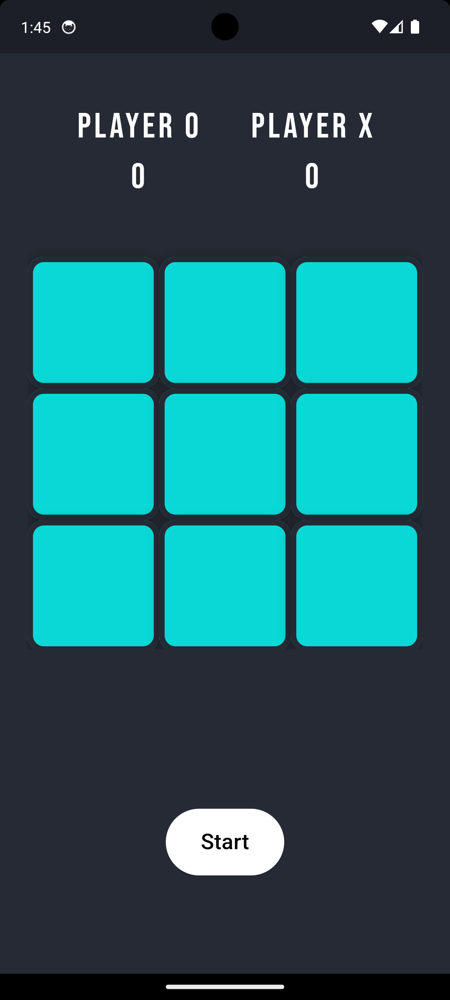
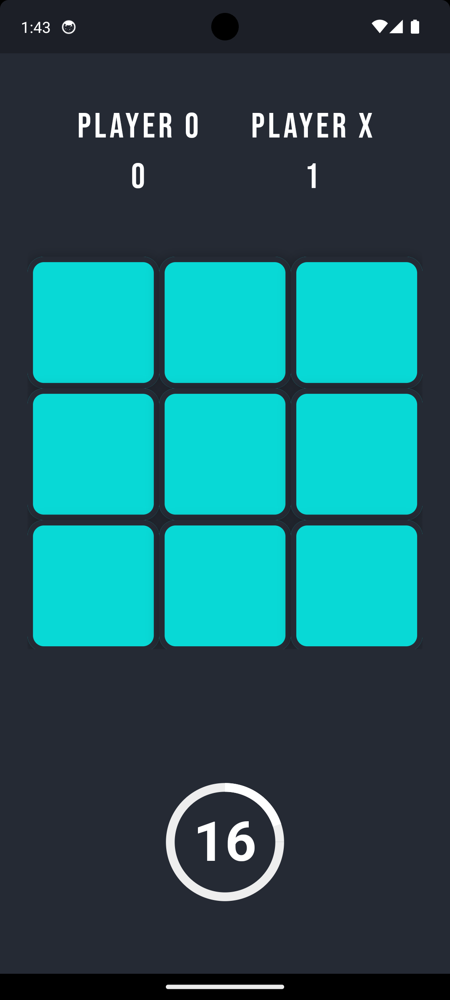
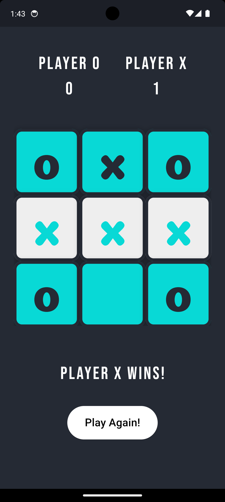
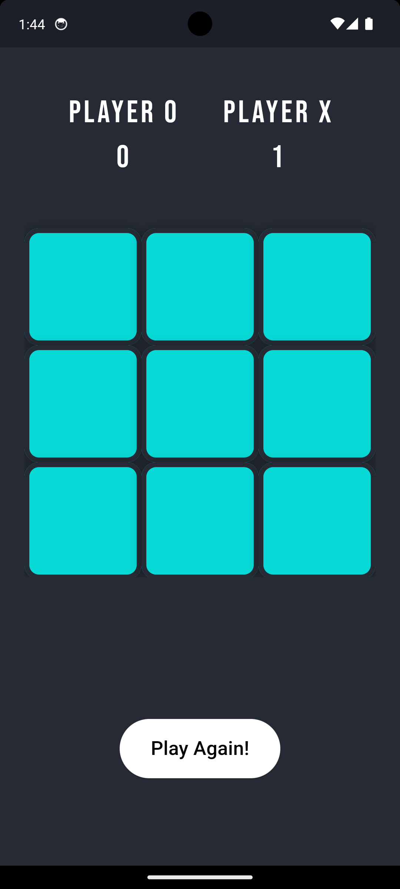

# Tic Tac Toe App

This is a simple Tic Tac Toe game developed using Flutter. The app features a splash screen, score tracking, and a timer for each player's turn.

## Features

- Splash screen with the app title
- Two-player mode (Player O and Player X)
- Score tracking for both players
- Countdown till game end
- Visual indicators for winning moves
- Custom Icon
- Custom Font Use

## Screenshots

<div align="center">
  
  
  
  
  
</div>

## Installation

1. Clone the repository:
   ```bash
   git clone https://github.com/th3varun/tic_tac_toe.git
   
2. Navigate to the project directory:
   ```bash
   cd tic_tac_toe
   
3. Install the dependencies:
   ```bash
   flutter pub get
   
4. Run the app:
   ```bash
   flutter run

## How to Play

- Open the app and wait for the splash screen to disappear.
- The game will start with Player O's turn.
- Tap on any empty box to make a move.
- The game will automatically switch to Player X's turn.
- The first player to get three of their symbols in a row (horizontally, vertically, or diagonally) wins.
- The score will be updated, and you can play again by pressing the "Play Again" button.

## Contributing

Feel free to fork this repository and contribute by submitting a pull request. Any contributions, issues, and feature requests are welcome.

## License

This project is licensed under the MIT License - see the `LICENSE` file for details.

Developed by Varun
